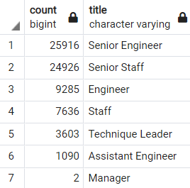
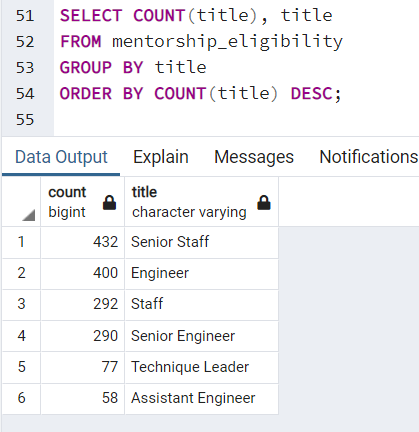
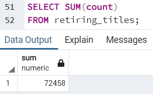
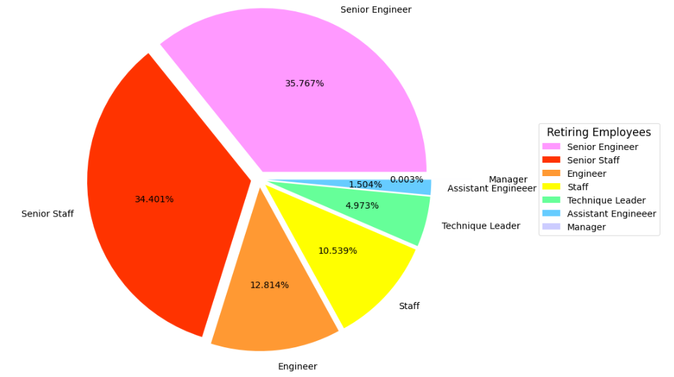
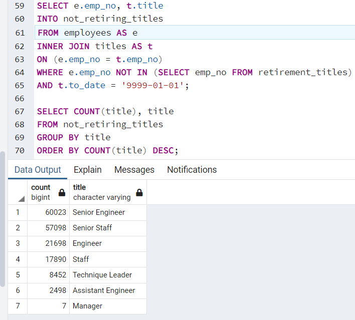

# Pewlett-Hackard-Analysis
[Employee Challenge](./Queries/Employee_Database_Challenge.sql)

## Overview
The purpose of this analysis is to determine the number of retiring employees per title and identify employees who are eligible to participate in the mentorship program. 

## Results
#### Retiring

- The categories with the most amount of retiring employees are senior engineer and senior staff member, with 25,916 employees retiring as a senior engineer and 24,926 employees retiring as a senior staff member.
- The category with the least amount of retiring employees is manager.

#### Mentorship-Eligible

- There are enough retiring employees to individually mentor the mentorship-eligible employees.
- There are more retiring employees than mentorship-eligible employees, so the pool of mentorship-eligible employees can be widened to have more retiring employees mentoring the next generation. Or the retiring employees who are not mentoring can put together a standardized guide, or other manuals and documents, that can help the next generation.

## Summary
### How many roles will need to be filled as the "silver tsunami" begins to make an impact?

There are a total of 72,458 employees retiring, thus 72,458 roles that need to be filled once those employees retire.

The senior engineer and senior staff categories are by far the largest categories of retiring employees and the manager category is by far the smallest category.
It would be worth investigating the system the managers participate in to ensure that they don't have a lot of employees retiring at the same time.
There may even be a mentorship system already in place to ensure senior leadership isn't suddenly removed, but instead, slowly transitioned into retirement.

### Are there enough qualified, retirement-ready employees in the departments to mentor the next generation of Pewlett Hackard employees?
#### Not Retiring

#### Retiring

#### Mentorship-Eligible

There are not enough qualified, retirement-ready employees in the department to each mentor one person of the next generation of Pewlett Hackard employees. However, there are enough employees to mentor the mentorship-eligible employees.
Still, other measures should be taken into consideration to mentor the next generation.
- Some retiring employees can individually mentor employees from the Mentorship-Eligible query.
- Each retiring employee can mentor a small group of employees who are not retiring.
- Retiring employees in each department can get together and create a standardized guide for the next generation of employees.
- Each retiring employee can mentor one or two people from the next generation with the intention that the person, or people, they mentor will take over their position once the employee retires.
- A combination of the previous suggestions can also be done.
